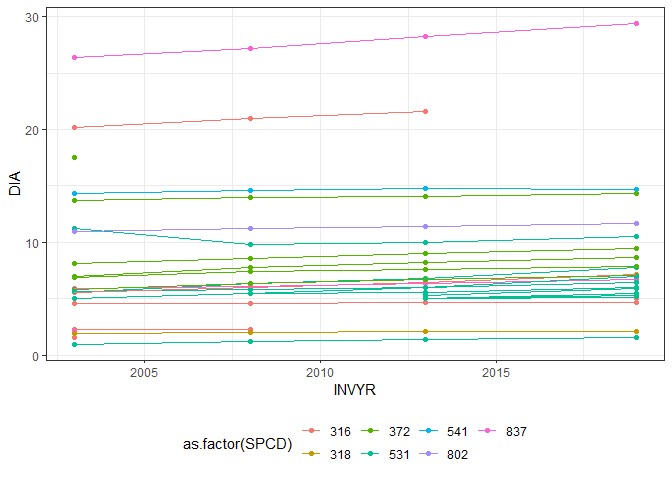
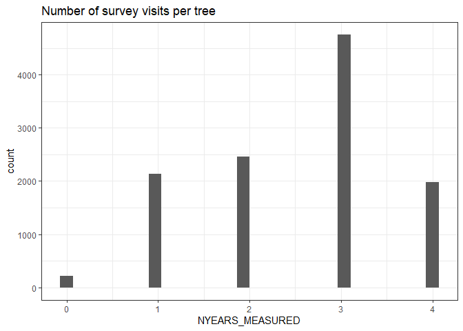

# ForestTIME

``` r
library(arrow)
```


    Attaching package: 'arrow'

    The following object is masked from 'package:utils':

        timestamp

``` r
library(dplyr)
```


    Attaching package: 'dplyr'

    The following objects are masked from 'package:stats':

        filter, lag

    The following objects are masked from 'package:base':

        intersect, setdiff, setequal, union

``` r
library(ggplot2)

states_to_include = "9"
raw_dir <- "data/rawdat/state"
arrow_dir <- "data/arrow"

trees <-
  open_dataset(
    here::here(arrow_dir, "TREE_RAW"),
    partitioning = c("STATECD", "COUNTYCD"),
    format = "csv",
    hive_style = T,
    col_types = schema(
      CN = float64(),
      TREE_FIRST_CN = float64()
    )) |>
  filter(STATECD %in% states_to_include) |>
  collect()

cns <-
  open_dataset(
    here::here(arrow_dir, "TREE_CNS"),
    partitioning = c("STATECD", "COUNTYCD"),
    format = "csv",
    hive_style = T,
    col_types = schema(
      CN = float64(),
      TREE_FIRST_CN = float64()
    )) |>
  filter(STATECD %in% states_to_include) |>
  collect()

tree_info <-  open_dataset(
  here::here(arrow_dir, "TREE_INFO"),
  partitioning = c("STATECD", "COUNTYCD"),
  format = "csv",
  hive_style = T,
  col_types = schema(TREE_FIRST_CN = float64())) |>
  filter(STATECD %in% states_to_include) |>
  collect()

tree_change <-  open_dataset(
  here::here(arrow_dir, "TREE_CHANGE"),
  partitioning = c("STATECD", "COUNTYCD"),
  format = "csv",
  hive_style = T,
  col_types = schema(TREE_FIRST_CN = float64())) |>
  filter(STATECD %in% states_to_include) |>
  collect()
```

# Tables

## TREE

``` r
head(trees)
```

    # A tibble: 6 × 11
           CN PREV_TRE_CN INVYR  PLOT STATUSCD   DIA    HT ACTUALHT  SPCD STATECD
        <dbl>       <dbl> <int> <int>    <int> <dbl> <int>    <int> <int>   <int>
    1 5.59e13          NA  2003   112        1   2.3    24       NA   316       9
    2 5.59e13          NA  2003   112        1   4.6    38       NA   316       9
    3 5.59e13          NA  2003   112        1   1      14       NA   531       9
    4 5.59e13          NA  2003   112        1   5.6    62       62   531       9
    5 5.59e13          NA  2003   112        1   5.6    64       64   316       9
    6 5.59e13          NA  2003   112        1   2.2    24       NA   837       9
    # ℹ 1 more variable: COUNTYCD <int>

## CNS

``` r
head(cns)
```

    # A tibble: 6 × 4
           CN TREE_FIRST_CN STATECD COUNTYCD
        <dbl>         <dbl>   <int>    <int>
    1 5.59e13       5.59e13       9        1
    2 2.08e14       5.59e13       9        1
    3 2.55e14       5.59e13       9        1
    4 5.59e13       5.59e13       9        1
    5 2.08e14       5.59e13       9        1
    6 2.55e14       5.59e13       9        1

## TREE_INFO

``` r
head(tree_info)
```

    # A tibble: 6 × 9
      TREE_FIRST_CN NYEARS NYEARS_MEASURED FIRSTYR LASTYR  SPCD  PLOT STATECD
              <dbl>  <int>           <int>   <int>  <int> <int> <int>   <int>
    1       5.59e13      4               4    2003   2020   318    24       9
    2       5.59e13      4               4    2003   2020   316    24       9
    3       5.59e13      4               4    2003   2020   316    24       9
    4       5.59e13      2               2    2003   2008   316    24       9
    5       5.59e13      4               4    2003   2020   316    24       9
    6       5.59e13      4               4    2003   2020   316    24       9
    # ℹ 1 more variable: COUNTYCD <int>

## TREE_CHANGE

``` r
head(tree_change)
```

    # A tibble: 6 × 17
      CN_CURRENT TREE_FIRST_CN CN_PREV INVYR_CURRENT  PLOT STATUSCD_CURRENT
           <dbl>         <dbl>   <dbl>         <int> <int>            <int>
    1    2.08e14       5.59e13 5.59e13          2008   323                1
    2    2.55e14       5.59e13 2.08e14          2013   323                1
    3    1.23e15       5.59e13 2.55e14          2020   323                1
    4    2.08e14       5.59e13 5.59e13          2008   323                1
    5    2.55e14       5.59e13 2.08e14          2013   323                1
    6    1.23e15       5.59e13 2.55e14          2020   323                2
    # ℹ 11 more variables: DIA_CURRENT <dbl>, HT_CURRENT <int>,
    #   ACTUALHT_CURRENT <int>, SPCD <int>, INVYR_PREV <int>, STATUSCD_PREV <int>,
    #   DIA_PREV <dbl>, HT_PREV <int>, ACTUALHT_PREV <int>, STATECD <int>,
    #   COUNTYCD <int>

# Using TREE_FIRST_CN to track individuals

``` r
individuals <- trees |> 
  left_join(cns) |>
  filter(PLOT %in% unique(PLOT)[1:15],
         STATUSCD %in% c(1:2))
```

    Joining with `by = join_by(CN, STATECD, COUNTYCD)`

``` r
ggplot(individuals, aes(INVYR, as.character(TREE_FIRST_CN))) + 
  geom_point() +
  facet_wrap(vars(PLOT), scales = "free_y") +
  theme_minimal() +
  theme(axis.text.y = element_blank()) +
  ggtitle("Individuals sampled each year")
```


``` r
ggplot(individuals |> filter(PLOT == 112), aes(INVYR, DIA, group = as.factor(TREE_FIRST_CN), color = as.factor(SPCD))) + 
  geom_point() +
  geom_line() +
  theme_bw() +
  theme(legend.position = "bottom")
```

    Warning: Removed 5 rows containing missing values (`geom_point()`).

    Warning: Removed 5 rows containing missing values (`geom_line()`).



``` r
ggplot(tree_info, aes(NYEARS_MEASURED)) + 
  geom_histogram() +
  theme_bw() +
  ggtitle("Number of survey visits per tree")
```

    `stat_bin()` using `bins = 30`. Pick better value with `binwidth`.



# Species with the most trees

``` r
tree_info |>
  group_by(SPCD) |>
  summarize(ntrees = dplyr::n()) |>
  ungroup() |>
  arrange(desc(ntrees)) |>
  head(10)
```

    # A tibble: 10 × 2
        SPCD ntrees
       <int>  <int>
     1   316   2936
     2   372   1155
     3   833    814
     4   261    761
     5   129    712
     6   802    527
     7   318    503
     8   837    466
     9   531    416
    10   541    415
