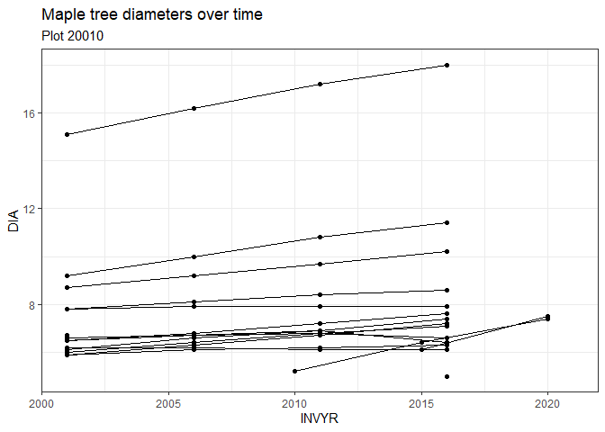

# Extracting FIA timeseries

## 1. `select_trees`

`select_trees()` extracts persistent IDs for all trees that meet
user-supplied criteria.

In this example, the criteria include:

- `STATECD`
- `COUNTYD`
- `PLOT`
- `SPCD`
- `min_years`, the minimum number of years between the first and last
  measurement
- `min_measurements`, the minimum number of survey visits to that tree

<div>

> **Note**
>
> What additional filtering criteria should there be?

</div>

By default, `select_trees` returns all trees:

``` r
my_trees <- select_trees()

nrow(my_trees)
```

    [1] 262322

``` r
knitr::kable(head(my_trees))
```

| TREE_FIRST_CN | NYEARS | NYEARS_MEASURED | FIRSTYR | LASTYR | SPCD |  PLOT | STATECD | COUNTYCD |
|--------------:|-------:|----------------:|--------:|-------:|-----:|------:|--------:|---------:|
|  6.531664e+13 |      4 |               4 |    2000 |   2015 |  313 | 20025 |      27 |      101 |
|  6.531664e+13 |      5 |               5 |    2000 |   2020 |  313 | 20025 |      27 |      101 |
|  6.531664e+13 |      5 |               5 |    2000 |   2020 |  462 | 20025 |      27 |      101 |
|  6.531665e+13 |      5 |               5 |    2000 |   2020 |  544 | 20025 |      27 |      101 |
|  6.531665e+13 |      5 |               5 |    2000 |   2020 |  823 | 20025 |      27 |      101 |
|  6.531665e+13 |      5 |               5 |    2000 |   2020 |  462 | 20025 |      27 |      101 |

Passing additional options filters the trees:

``` r
# Extract all red maples (SPCD = 316)

my_red_maples <- select_trees(spcd = 316)

nrow(my_red_maples)
```

    [1] 9546

``` r
knitr::kable(head(my_red_maples))
```

| TREE_FIRST_CN | NYEARS | NYEARS_MEASURED | FIRSTYR | LASTYR | SPCD |  PLOT | STATECD | COUNTYCD |
|--------------:|-------:|----------------:|--------:|-------:|-----:|------:|--------:|---------:|
|  6.519121e+13 |      5 |               5 |    2000 |   2020 |  316 | 20138 |      27 |        1 |
|  6.519301e+13 |      5 |               5 |    2000 |   2020 |  316 | 20151 |      27 |        1 |
|  6.519303e+13 |      5 |               5 |    2000 |   2020 |  316 | 20151 |      27 |        1 |
|  6.519588e+13 |      5 |               5 |    2000 |   2020 |  316 | 20174 |      27 |        1 |
|  6.519588e+13 |      5 |               5 |    2000 |   2020 |  316 | 20174 |      27 |        1 |
|  6.519588e+13 |      5 |               5 |    2000 |   2020 |  316 | 20174 |      27 |        1 |

``` r
# Extract red maples on plot 20010

my_red_maples_one_plot <- select_trees(spcd = 316,
                                   plot = 20010)

nrow(my_red_maples_one_plot)
```

    [1] 17

``` r
knitr::kable(head(my_red_maples_one_plot))
```

| TREE_FIRST_CN | NYEARS | NYEARS_MEASURED | FIRSTYR | LASTYR | SPCD |  PLOT | STATECD | COUNTYCD |
|--------------:|-------:|----------------:|--------:|-------:|-----:|------:|--------:|---------:|
|  6.585573e+13 |      5 |               5 |    2001 |   2021 |  316 | 20010 |      27 |       21 |
|  6.585573e+13 |      2 |               2 |    2001 |   2006 |  316 | 20010 |      27 |       21 |
|  6.585573e+13 |      5 |               5 |    2001 |   2021 |  316 | 20010 |      27 |       21 |
|  6.585573e+13 |      5 |               5 |    2001 |   2021 |  316 | 20010 |      27 |       21 |
|  6.585574e+13 |      5 |               5 |    2001 |   2021 |  316 | 20010 |      27 |       21 |
|  6.585574e+13 |      5 |               5 |    2001 |   2021 |  316 | 20010 |      27 |       21 |

## `get_timeseries`

`get_timeseries` extracts measurements for a selection of trees. By
default, it will return all measurements of `DIA`, `HT`, and `STATUSCD`
for the given trees. The time window included can be modified using the
`min_year` and `max_year` arguments. The measurements returned can be
modified to add additional variables using the `variables` argument.
Currently, any of the columns of the `TREE` table can be added as
additional variables.

<div>

> **Note**
>
> What should be the default measurements provided?
>
> What additional options should there be, including options from other
> tables?

</div>

For example, extracting the default measurements for all years for red
maples on plot 20010:

``` r
my_maple_timeseries <- get_timeseries(my_red_maples_one_plot)

nrow(my_maple_timeseries)
```

    [1] 74

``` r
knitr::kable(head(my_maple_timeseries))
```

| TREE_FIRST_CN |           CN | INVYR | STATECD | COUNTYCD | UNITCD |  PLOT | SUBP | TREE |  DIA |  HT | STATUSCD |
|--------------:|-------------:|------:|--------:|---------:|-------:|------:|-----:|-----:|-----:|----:|---------:|
|  6.585573e+13 | 6.585573e+13 |  2001 |      27 |       21 |      2 | 20010 |    1 |    1 | 15.1 |  58 |        1 |
|  6.585573e+13 | 6.585573e+13 |  2001 |      27 |       21 |      2 | 20010 |    1 |    2 |  6.7 |  32 |        1 |
|  6.585573e+13 | 6.585573e+13 |  2001 |      27 |       21 |      2 | 20010 |    1 |    3 |  7.8 |  44 |        1 |
|  6.585573e+13 | 6.585573e+13 |  2001 |      27 |       21 |      2 | 20010 |    1 |    4 |  6.5 |  47 |        1 |
|  6.585574e+13 | 6.585574e+13 |  2001 |      27 |       21 |      2 | 20010 |    1 |    5 |  6.2 |  42 |        2 |
|  6.585574e+13 | 6.585574e+13 |  2001 |      27 |       21 |      2 | 20010 |    1 |    6 |  6.0 |  44 |        1 |

Modifying the time window and variables to return:

``` r
my_maple_timeseries2 <- get_timeseries(my_red_maples_one_plot,
                                            min_year = 2010,
                                            max_year = 2023,
                                            variables = c("DIA", "HT", "ACTUALHT"))

nrow(my_maple_timeseries2)
```

    [1] 46

``` r
knitr::kable(head(my_maple_timeseries2))
```

| TREE_FIRST_CN |           CN | INVYR | STATECD | COUNTYCD | UNITCD |  PLOT | SUBP | TREE |  DIA |  HT | ACTUALHT |
|--------------:|-------------:|------:|--------:|---------:|-------:|------:|-----:|-----:|-----:|----:|---------:|
|  6.585573e+13 | 1.549513e+13 |  2011 |      27 |       21 |      2 | 20010 |    1 |    1 | 17.2 |  60 |       60 |
|  6.585573e+13 | 1.549513e+13 |  2011 |      27 |       21 |      2 | 20010 |    1 |    3 |  8.4 |  56 |       56 |
|  6.585573e+13 | 1.549513e+13 |  2011 |      27 |       21 |      2 | 20010 |    1 |    4 |  6.9 |  54 |       54 |
|  6.585574e+13 | 1.549513e+13 |  2011 |      27 |       21 |      2 | 20010 |    1 |    5 |  6.1 |  42 |       11 |
|  6.585574e+13 | 1.549513e+13 |  2011 |      27 |       21 |      2 | 20010 |    1 |    6 |  6.8 |  58 |       58 |
|  6.585574e+13 | 1.549513e+13 |  2011 |      27 |       21 |      2 | 20010 |    1 |    7 |  6.7 |  58 |       58 |

Here is a plot of how individual maple trees’ diameters have changed
over time:

    Warning: Removed 15 rows containing missing values (`geom_line()`).

    Warning: Removed 15 rows containing missing values (`geom_point()`).


