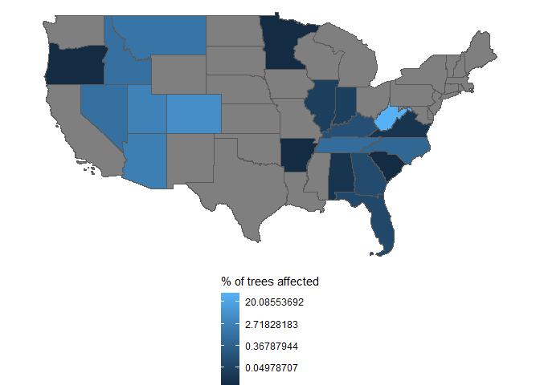

# Comparison of daisy chain and tree number

## Context

The “daisy chain” method is to link backwards in time using
`PREV_TRE_CN` and `CN`. The “tree number” method is to concatenate
columns `STATECD`, `UNITCD`, `COUNTYCD`, `PLOT`, `SUBP`, and `TREE` to
get a unique tree number for each tree. In principle these *should* give
equivalent outcomes, but we don’t know if they really always do!

## States and trees affected

### How many states are affected?

| is_affected |   n |
|:------------|----:|
| FALSE       |  29 |
| TRUE        |  21 |

### How many trees/state are affected?

    Warning: Transformation introduced infinite values in discrete y-axis

### What (generally) describes the affect?

