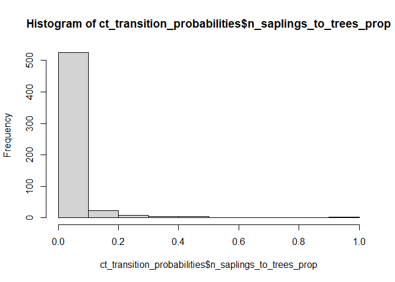
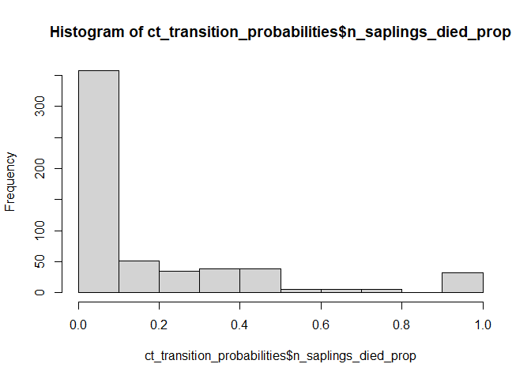

# Ingrowth

``` r
library(dplyr)
```

    Warning: package 'dplyr' was built under R version 4.3.2


    Attaching package: 'dplyr'

    The following objects are masked from 'package:stats':

        filter, lag

    The following objects are masked from 'package:base':

        intersect, setdiff, setequal, union

``` r
library(ggplot2)
source(here::here("R", "query_tables.R"))
```

    Warning: package 'duckdbfs' was built under R version 4.3.2

``` r
ct_trees <- get_timeseries(conditions = list(
  STATECD = list("==", "9")
))
```

    Joining with `by = join_by(PLT_CN, INVYR, UNITCD, PLOT, PLOT_UNIQUE_ID,
    COUNTYCD, STATECD)`

    Joining with `by = join_by(PLT_CN, INVYR, UNITCD, PLOT, PLOT_UNIQUE_ID,
    COUNTYCD, STATECD)`

Pull out timeseries of trees that have ever been recorded as saplings.

For now, dropping the duplicated CYCLES with changing CONDIDS.

``` r
ct_saplings <- ct_trees |>
  filter(DIA < 5) |>
  select(TREE_UNIQUE_ID) |>
  distinct() |>
  left_join(ct_trees |> select(-COND_STATUS_CD, -CONDID, -OWNCD, -CN) |> distinct())
```

    Joining with `by = join_by(TREE_UNIQUE_ID)`

Track saplings’ fates over time (change last measurement to this one).

``` r
ct_sapling_fates <- ct_saplings |>
  arrange(TREE_UNIQUE_ID, MEASYEAR) |>
  group_by(TREE_UNIQUE_ID) |>
  mutate(
    last_meas_year = lag(MEASYEAR, default = NA),
    last_status = lag(STATUSCD, default = NA),
    last_DIA = lag(DIA, default = NA)
  ) |>
  group_by_all() |>
  mutate(
    is_sapling = STATUSCD == 1 && DIA < 5,
    new_sapling = is.na(last_meas_year) && is.na(last_status)  && is.na(last_DIA) && STATUSCD == 1,
    sapling_sapling = last_status ==1 && STATUSCD == 1 && DIA < 5 && last_DIA < 5,
    sapling_tree = last_status == 1 && STATUSCD == 1 && DIA >= 5 && last_DIA < 5,
    sapling_dead = last_status == 1 && STATUSCD == 2 && last_DIA < 5,
    sapling_removed = last_status == 1 && STATUSCD == 3 && last_DIA < 5
  )
```

Calculate absolute numbers of trees making each transition, and
calculate these as proportions of the saplings that existed in the most
recent survey.

``` r
ct_sapling_transitions <- ct_sapling_fates |>
  group_by(PLOT_UNIQUE_ID, CYCLE, MEASYEAR) |>
  summarize(
    n_saplings = sum(is_sapling, na.rm = T),
    n_new_saplings = sum(new_sapling, na.rm = T),
    n_sapling_saplings = sum(sapling_sapling, na.rm = T),
    n_saplings_to_trees = sum(sapling_tree, na.rm = T),
    n_saplings_died = sum(sapling_dead, na.rm = T),
    n_saplings_removed = sum(sapling_removed, na.rm = T)
  ) |>
  ungroup() |>
  arrange(PLOT_UNIQUE_ID, CYCLE, MEASYEAR) |> 
  group_by(PLOT_UNIQUE_ID) |> 
  mutate(n_saplings_previous = lag(n_saplings, default = NA),
         prev_measyear = lag(MEASYEAR),
         first_measyear = min(MEASYEAR)) |>
  group_by_all() |>
  mutate(is_first_measyear = MEASYEAR == first_measyear) |>
  ungroup()
```

    `summarise()` has grouped output by 'PLOT_UNIQUE_ID', 'CYCLE'. You can override
    using the `.groups` argument.

``` r
ct_transition_probabilities <- ct_sapling_transitions |>
  filter(!is_first_measyear) |>
  mutate(across(all_of(c('n_sapling_saplings',
                'n_saplings_to_trees',
                'n_saplings_died',
                'n_saplings_removed')),
                .fns = list(prop = (\(x) x / n_saplings_previous))))
```

Look at these counts and transition “probabilities”:

``` r
knitr::kable(head(ct_transition_probabilities))
```

| PLOT_UNIQUE_ID | CYCLE | MEASYEAR | n_saplings | n_new_saplings | n_sapling_saplings | n_saplings_to_trees | n_saplings_died | n_saplings_removed | n_saplings_previous | prev_measyear | first_measyear | is_first_measyear | n_sapling_saplings_prop | n_saplings_to_trees_prop | n_saplings_died_prop | n_saplings_removed_prop |
|:---------------|------:|---------:|-----------:|---------------:|-------------------:|--------------------:|----------------:|-------------------:|--------------------:|--------------:|---------------:|:------------------|------------------------:|-------------------------:|---------------------:|------------------------:|
| 9_1_11_105     |     7 |     2016 |          3 |              0 |                  3 |                   0 |               0 |                  0 |                   3 |          2010 |           2010 | FALSE             |                    1.00 |                    0.000 |                0.000 |                       0 |
| 9_1_11_107     |     6 |     2012 |          1 |              0 |                  1 |                   0 |               1 |                  0 |                   2 |          2008 |           2008 | FALSE             |                    0.50 |                    0.000 |                0.500 |                       0 |
| 9_1_11_107     |     7 |     2018 |          2 |              1 |                  1 |                   0 |               0 |                  0 |                   1 |          2012 |           2008 | FALSE             |                    1.00 |                    0.000 |                0.000 |                       0 |
| 9_1_11_135     |     6 |     2008 |          4 |              0 |                  4 |                   1 |               3 |                  0 |                   8 |          2003 |           2003 | FALSE             |                    0.50 |                    0.125 |                0.375 |                       0 |
| 9_1_11_135     |     7 |     2014 |          3 |              0 |                  3 |                   0 |               1 |                  0 |                   4 |          2008 |           2003 | FALSE             |                    0.75 |                    0.000 |                0.250 |                       0 |
| 9_1_11_135     |     8 |     2020 |          3 |              0 |                  3 |                   0 |               0 |                  0 |                   3 |          2014 |           2003 | FALSE             |                    1.00 |                    0.000 |                0.000 |                       0 |

``` r
hist(ct_transition_probabilities$n_saplings_to_trees_prop)
```



``` r
hist(ct_transition_probabilities$n_saplings_died_prop)
```



Export these tables for sharing:

``` r
write.csv(ct_sapling_fates, here::here("use_cases", "ingrowth", "ct_sapling_fates.csv"), row.names = F)

write.csv(ct_transition_probabilities, here::here("use_cases", "ingrowth", "ct_transition_probabilities.csv"), row.names = F)
```
