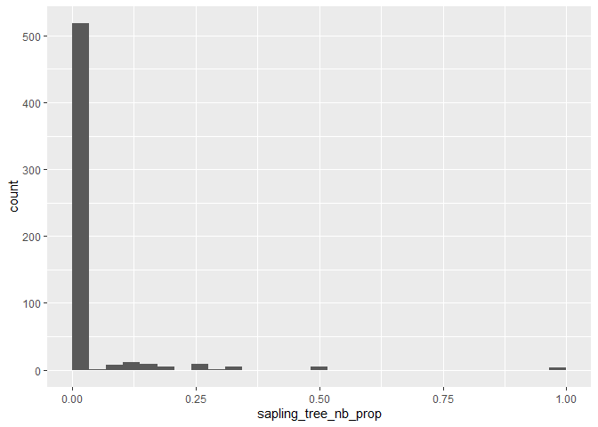

# Sapling abundance and transition rates

``` r
library(duckdb)
```

    Loading required package: DBI

``` r
library(dplyr)
```

    Warning: package 'dplyr' was built under R version 4.3.2


    Attaching package: 'dplyr'

    The following objects are masked from 'package:stats':

        filter, lag

    The following objects are masked from 'package:base':

        intersect, setdiff, setequal, union

``` r
library(ggplot2)

source(here::here("R", "query_tables_db_fxns.R"))
source(here::here("use_cases", "ingrowth", "sapling_functions.R"))

con <- connect_to_tables(here::here("data", "db", "forestTIME-cli.duckdb"))
```

# Sapling presence

We can pull saplings for a state (or any other set of filter variables)
with this function:

``` r
ct_saplings <- generate_sapling_table(con = con,
                                      tree_id_method = "composite",
                                      conditions = create_conditions(STATECD == 9))
```

    Joining with `by = join_by(TREE_UNIQUE_ID, PLOT_UNIQUE_ID, SPCD, PLOT, STATECD, COUNTYCD)`
    Joining with `by = join_by(PLOT_UNIQUE_ID, PLOT, STATECD, COUNTYCD, PLT_CN, INVYR, UNITCD, CYCLE, SUBCYCLE)`
    Joining with `by = join_by(PLOT_UNIQUE_ID, PLOT, STATECD, COUNTYCD, PLT_CN, INVYR, UNITCD, CONDID, CYCLE, SUBCYCLE)`

``` r
knitr::kable(head(ct_saplings))
```

| TREE_UNIQUE_ID | PLOT_UNIQUE_ID | SPCD | PLOT | SUBPLOT | SPCDS | COUNTYCD | STATECD |       PLT_CN | INVYR | CYCLE | MEASYEAR |           CN |      COND_CN | CONDID | DIA |  HT | ACTUALHT | TPA_UNADJ | STATUSCD | COND_STATUS_CD |
|:---------------|:---------------|-----:|-----:|--------:|------:|---------:|--------:|-------------:|------:|------:|---------:|-------------:|-------------:|-------:|----:|----:|---------:|----------:|---------:|---------------:|
| 9_1_1_373_2_6  | 9_1_1_373      |   68 |  373 |       2 |     1 |        1 |       9 | 5.591475e+13 |  2003 |     5 |     2003 | 5.591480e+13 | 5.591475e+13 |      1 | 2.6 |  21 |       NA |  74.96528 |        1 |              1 |
| 9_1_1_478_2_8  | 9_1_1_478      |  318 |  478 |       2 |     1 |        1 |       9 | 5.591494e+13 |  2003 |     5 |     2003 | 5.591496e+13 | 5.591494e+13 |      1 | 3.2 |  30 |       NA |  74.96528 |        1 |              1 |
| 9_1_3_97_4_11  | 9_1_3_97       |  316 |   97 |       4 |     1 |        3 |       9 | 5.591515e+13 |  2003 |     5 |     2004 | 5.591527e+13 | 5.591516e+13 |      1 | 3.7 |  33 |       NA |  74.96528 |        1 |              1 |
| 9_1_3_165_2_18 | 9_1_3_165      |  316 |  165 |       2 |     1 |        3 |       9 | 5.591528e+13 |  2003 |     5 |     2003 | 5.591532e+13 | 5.591528e+13 |      1 | 3.3 |  31 |       NA |  74.96528 |        1 |              1 |
| 9_1_3_230_3_8  | 9_1_3_230      |  833 |  230 |       3 |     1 |        3 |       9 | 5.591547e+13 |  2003 |     5 |     2003 | 5.591550e+13 | 5.591547e+13 |      1 | 3.4 |  28 |       28 |  74.96528 |        1 |              1 |
| 9_1_3_365_1_4  | 9_1_3_365      |  491 |  365 |       1 |     1 |        3 |       9 | 5.591580e+13 |  2003 |     5 |     2003 | 5.591584e+13 | 5.591580e+13 |      1 | 1.6 |  19 |       NA |  74.96528 |        1 |              1 |

This table contains the necessary information to compute the abundance
or biomass of saplings on a (sub)plot, and includes the `TPA_UNADJ`
column for scaling to the whole plot scale.

# Transition rates

We can pull a sapling transition table for Connecticut:

``` r
ct_transitions <- generate_sapling_transition_table(con = con,
                                                    tree_id_method = "composite",
                                                    conditions = create_conditions(STATECD == 9))
```

    Joining with `by = join_by(TREE_UNIQUE_ID, PLOT_UNIQUE_ID, SPCD, PLOT, STATECD, COUNTYCD)`
    Joining with `by = join_by(PLOT_UNIQUE_ID, PLOT, STATECD, COUNTYCD, PLT_CN, INVYR, UNITCD, CYCLE, SUBCYCLE)`
    Joining with `by = join_by(PLOT_UNIQUE_ID, PLOT, STATECD, COUNTYCD, PLT_CN, INVYR, UNITCD, CONDID, CYCLE, SUBCYCLE)`
    Joining with `by = join_by(TREE_UNIQUE_ID)`
    `summarise()` has grouped output by 'PLOT_UNIQUE_ID'. You can override using the `.groups` argument.

``` r
knitr::kable(head(ct_transitions))
```

| PLOT_UNIQUE_ID | MEASYEAR | live_sapling_nb | new_sapling_nb | sapling_sapling_nb | sapling_tree_nb | sapling_dead_nb | sapling_removed_nb | sapling_not_sampled_nb | sapling_missing_data_nb | sapling_vanishes_next_year_nb | PREV_live_sapling_nb | sapling_vanished_nb | PREV_MEASYEAR | presumed_dead_nb | timespan | sapling_sapling_nb_prop | sapling_tree_nb_prop | sapling_removed_nb_prop | presumed_dead_nb_prop | sapling_not_sampled_nb_prop | sapling_missing_data_nb_prop |
|:---------------|---------:|----------------:|---------------:|-------------------:|----------------:|----------------:|-------------------:|-----------------------:|------------------------:|------------------------------:|---------------------:|--------------------:|--------------:|-----------------:|---------:|------------------------:|---------------------:|------------------------:|----------------------:|----------------------------:|-----------------------------:|
| 9_1_11_105     |     2016 |               3 |              0 |                  3 |               0 |               0 |                  0 |                      0 |                       0 |                             3 |                    3 |                   0 |          2010 |                0 |        6 |                    1.00 |                0.000 |                       0 |                 0.000 |                           0 |                            0 |
| 9_1_11_107     |     2012 |               1 |              0 |                  1 |               0 |               1 |                  0 |                      0 |                       0 |                             0 |                    4 |                   2 |          2008 |                3 |        4 |                    0.25 |                0.000 |                       0 |                 0.750 |                           0 |                            0 |
| 9_1_11_107     |     2018 |               2 |              1 |                  1 |               0 |               0 |                  0 |                      0 |                       0 |                             2 |                    1 |                   0 |          2012 |                0 |        6 |                    1.00 |                0.000 |                       0 |                 0.000 |                           0 |                            0 |
| 9_1_11_135     |     2008 |               4 |              0 |                  4 |               1 |               3 |                  0 |                      0 |                       0 |                             0 |                    8 |                   0 |          2003 |                3 |        5 |                    0.50 |                0.125 |                       0 |                 0.375 |                           0 |                            0 |
| 9_1_11_135     |     2014 |               3 |              0 |                  3 |               0 |               1 |                  0 |                      0 |                       0 |                             0 |                    4 |                   0 |          2008 |                1 |        6 |                    0.75 |                0.000 |                       0 |                 0.250 |                           0 |                            0 |
| 9_1_11_135     |     2020 |               3 |              0 |                  3 |               0 |               0 |                  0 |                      0 |                       0 |                             3 |                    3 |                   0 |          2014 |                0 |        6 |                    1.00 |                0.000 |                       0 |                 0.000 |                           0 |                            0 |

And look at the distribution of death and recruitment rates:

``` r
ggplot(ct_transitions, aes(presumed_dead_nb_prop)) +
  geom_histogram(boundary = 0)
```

    `stat_bin()` using `bins = 30`. Pick better value with `binwidth`.

    Warning: Removed 26 rows containing non-finite values (`stat_bin()`).


``` r
ggplot(ct_transitions, aes(sapling_tree_nb_prop)) +
  geom_histogram(boundary = 0)
```

    `stat_bin()` using `bins = 30`. Pick better value with `binwidth`.

    Warning: Removed 26 rows containing non-finite values (`stat_bin()`).



You can also pull for, for example, just one species:

``` r
mn_red_maple_transitions <- generate_sapling_transition_table(con = con,
                                                    tree_id_method = "composite",
                                                    conditions = create_conditions(STATECD == 27,
                                                                                   SPCD == 316,
                                                                                   SPCDS == 1)) # this removes some records of trees changing species, which mess up the proportion sums
```

    Joining with `by = join_by(TREE_UNIQUE_ID, PLOT_UNIQUE_ID, SPCD, PLOT, STATECD, COUNTYCD)`
    Joining with `by = join_by(PLOT_UNIQUE_ID, PLOT, STATECD, COUNTYCD, PLT_CN, INVYR, UNITCD, CYCLE, SUBCYCLE)`
    Joining with `by = join_by(PLOT_UNIQUE_ID, PLOT, STATECD, COUNTYCD, PLT_CN, INVYR, UNITCD, CONDID, CYCLE, SUBCYCLE)`
    Joining with `by = join_by(TREE_UNIQUE_ID)`
    `summarise()` has grouped output by 'PLOT_UNIQUE_ID'. You can override using the `.groups` argument.

``` r
knitr::kable(head(mn_red_maple_transitions))
```

| PLOT_UNIQUE_ID | MEASYEAR | live_sapling_nb | new_sapling_nb | sapling_sapling_nb | sapling_tree_nb | sapling_dead_nb | sapling_removed_nb | sapling_not_sampled_nb | sapling_missing_data_nb | sapling_vanishes_next_year_nb | PREV_live_sapling_nb | sapling_vanished_nb | PREV_MEASYEAR | presumed_dead_nb | timespan | sapling_sapling_nb_prop | sapling_tree_nb_prop | sapling_removed_nb_prop | presumed_dead_nb_prop | sapling_not_sampled_nb_prop | sapling_missing_data_nb_prop |
|:---------------|---------:|----------------:|---------------:|-------------------:|----------------:|----------------:|-------------------:|-----------------------:|------------------------:|------------------------------:|---------------------:|--------------------:|--------------:|-----------------:|---------:|------------------------:|---------------------:|------------------------:|----------------------:|----------------------------:|-----------------------------:|
| 27_1_137_10494 |     2010 |               4 |              1 |                  3 |               0 |               0 |                  0 |                      0 |                       0 |                             0 |                    3 |                   0 |          2005 |                0 |        5 |                       1 |                    0 |                       0 |                     0 |                           0 |                            0 |
| 27_1_137_10494 |     2015 |               0 |              0 |                  0 |               0 |               0 |                  0 |                      4 |                       0 |                             0 |                    4 |                   0 |          2010 |                0 |        5 |                       0 |                    0 |                       0 |                     0 |                           1 |                            0 |
| 27_1_137_10507 |     2009 |               2 |              1 |                  1 |               0 |               0 |                  0 |                      0 |                       0 |                             0 |                    1 |                   0 |          2004 |                0 |        5 |                       1 |                    0 |                       0 |                     0 |                           0 |                            0 |
| 27_1_137_10507 |     2014 |               2 |              0 |                  2 |               0 |               0 |                  0 |                      0 |                       0 |                             0 |                    2 |                   0 |          2009 |                0 |        5 |                       1 |                    0 |                       0 |                     0 |                           0 |                            0 |
| 27_1_137_10507 |     2019 |               2 |              0 |                  2 |               0 |               0 |                  0 |                      0 |                       0 |                             2 |                    2 |                   0 |          2014 |                0 |        5 |                       1 |                    0 |                       0 |                     0 |                           0 |                            0 |
| 27_1_137_20222 |     2005 |               1 |              0 |                  1 |               0 |               0 |                  0 |                      0 |                       0 |                             0 |                    1 |                   0 |          2000 |                0 |        5 |                       1 |                    0 |                       0 |                     0 |                           0 |                            0 |

``` r
dbDisconnect(con, shutdown = TRUE)
```
