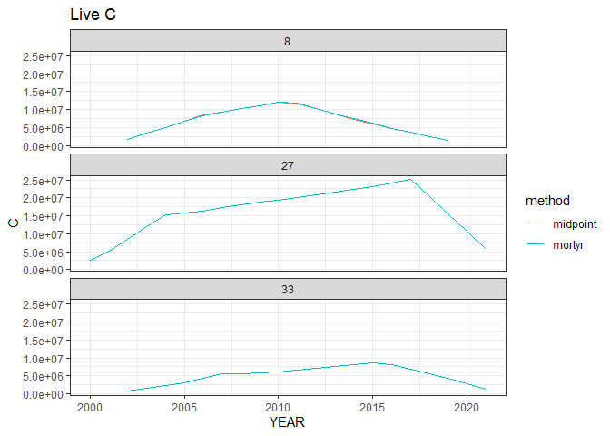
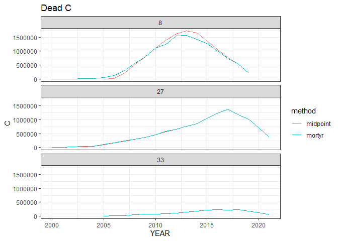

# Extract annualized measurements


# Pulling trees

``` r
library(duckdb)
```

    Loading required package: DBI

``` r
library(dplyr)
```


    Attaching package: 'dplyr'

    The following objects are masked from 'package:stats':

        filter, lag

    The following objects are masked from 'package:base':

        intersect, setdiff, setequal, union

``` r
library(ggplot2)
source(here::here("R", "query_tables_db_fxns.R"))

con <- connect_to_tables(here::here("data", "db", "foresttime-carbon.duckdb"))

mortyr_carbon <- tbl(con, "tree_carbon_annualized_mortyr") |>
  collect()

midpoint_carbon <- tbl(con, "tree_carbon_annualized_midpoint") |>
  collect()

mortyr_carbon_total <- mortyr_carbon |> group_by(YEAR, STATECD, STATUSCD) |> summarize(C = sum(CARBON, na.rm = T)) |> ungroup()  |> 
  mutate(method = "mortyr")
```

    `summarise()` has grouped output by 'YEAR', 'STATECD'. You can override using
    the `.groups` argument.

``` r
midpoint_carbon_total <- midpoint_carbon |> group_by(YEAR, STATECD, STATUSCD) |> summarize(C = sum(CARBON, na.rm = T)) |> ungroup() |> 
  mutate(method = "midpoint")
```

    `summarise()` has grouped output by 'YEAR', 'STATECD'. You can override using
    the `.groups` argument.

``` r
both_carbon_totals <- bind_rows(mortyr_carbon_total,
                                midpoint_carbon_total)

ggplot(both_carbon_totals |> filter(STATUSCD == 1), aes(YEAR, C, color = method)) + geom_line() + facet_wrap(vars(STATECD), ncol = 1) + theme_bw() + ggtitle("Live C")
```



``` r
ggplot(both_carbon_totals |> filter(STATUSCD == 2), aes(YEAR, C, color = method)) + geom_line() + facet_wrap(vars(STATECD), ncol = 1) + theme_bw() + ggtitle("Dead C")
```



``` r
included_trees <- unique(c(mortyr_carbon$TREE_COMPOSITE_ID,
                           midpoint_carbon$TREE_COMPOSITE_ID))

excluded_trees <- tbl(con, "tree_info_composite_id") |>
  filter(!(TREE_COMPOSITE_ID %in% included_trees)) |> 
  collect()

excluded_trees |>
  group_by(STATECD) |>
  tally()
```

    # A tibble: 3 × 2
      STATECD      n
        <dbl>  <int>
    1       8  63264
    2      27 140937
    3      33  20262

``` r
mortyr_carbon |> select(TREE_COMPOSITE_ID, STATECD) |>
  distinct() |>
  group_by(STATECD) |>
  tally()
```

    # A tibble: 3 × 2
      STATECD      n
        <dbl>  <int>
    1       8  82091
    2      27 210274
    3      33  48206

``` r
dbDisconnect(con, shutdown = TRUE)
```
