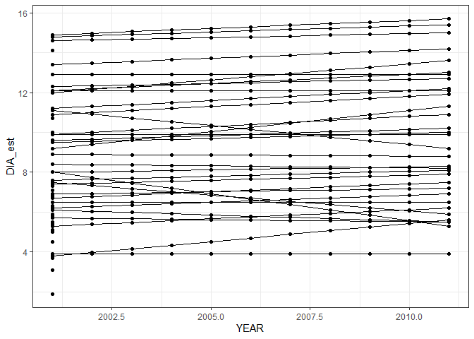

# Extract annualized measurements

# Pulling trees

``` r
source(here::here("R", "query_tables_db_fxns.R"))
```

    Loading required package: DBI

    Warning: package 'DBI' was built under R version 4.3.2

    Warning: package 'dplyr' was built under R version 4.3.2


    Attaching package: 'dplyr'

    The following objects are masked from 'package:stats':

        filter, lag

    The following objects are masked from 'package:base':

        intersect, setdiff, setequal, union

``` r
source(here::here("R", "query_annualized.R"))

con <- connect_to_tables(here::here("data", "db", "derived_tables3.duckdb"))
```

``` r
az_nfs_annualized <- query_annualized(con,
                                      conditions = create_conditions(
                                        STATECD == 4,
                                        OWNCD == 11,
                                        MULTI_OWNCD_FLAG == FALSE,
                                        MULTI_ADFORCD_FLAG == FALSE
                                      ),
                                      variables = c("DIA_est", "HT_est", "YEAR", "ADFORCD", "SPCD_CORR", "SPCD_FLAG"))
```

    Joining with `by = join_by(TREE_COMPOSITE_ID)`
    Joining with `by = join_by(TREE_COMPOSITE_ID, SPCD_CORR, TREE_CN)`
    Joining with `by = join_by(PLOT_COMPOSITE_ID, PLOT, STATECD, COUNTYCD, PLT_CN, INVYR, CYCLE)`
    Joining with `by = join_by(PLOT_COMPOSITE_ID, PLOT, STATECD, COUNTYCD, PLT_CN, CONDID, INVYR, CYCLE, UNITCD, SUBCYCLE)`

``` r
library(ggplot2)

ggplot(filter(az_nfs_annualized, PLOT_COMPOSITE_ID == "4_1_11_80342"), aes(YEAR, DIA_est, group = TREE_COMPOSITE_ID)) +
  geom_line() +
  geom_point() +
  theme_bw()
```



``` r
dbDisconnect(con, shutdown = TRUE)
```
