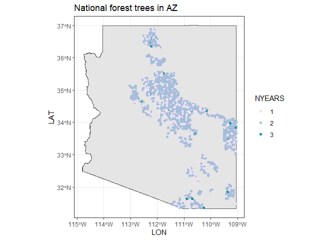

# Extract trees from national forests

Here I am attempting to pull records of trees on national forests in
Arizona.

``` r
system.time(az_nfs <- get_timeseries(
  conditions = list(STATECD = list("==", c(4)),
                    OWNCD = list("==", 11)),
  variables = c("STATUSCD", "DIA", "HT", "OWNCD", "LAT", "LON", "CONDID")
))
```

    Joining with `by = join_by(PLT_CN, INVYR, UNITCD, PLOT, PLOT_UNIQUE_ID, COUNTYCD, STATECD)`
    Joining with `by = join_by(PLT_CN, INVYR, UNITCD, PLOT, PLOT_UNIQUE_ID, COUNTYCD, STATECD)`

       user  system elapsed 
     139.84  233.68  141.39 

``` r
knitr::kable(head(az_nfs))
```

| TREE_UNIQUE_ID   | PLOT_UNIQUE_ID |           CN | INVYR | STATECD | COUNTYCD | UNITCD |  PLOT | SUBP | TREE | SPCD | STATUSCD |  DIA |  HT | OWNCD |      LAT |       LON | CONDID |
|:-----------------|:---------------|-------------:|------:|--------:|---------:|-------:|------:|-----:|-----:|-----:|---------:|-----:|----:|------:|---------:|----------:|-------:|
| 4_1_11_80122_1_1 | 4_1_11_80122   | 4.241832e+13 |  2010 |       4 |       11 |      1 | 80122 |    1 |    1 |   63 |        1 |  9.5 |  19 |    11 | 33.11304 | -109.1213 |      1 |
| 4_1_11_80122_1_2 | 4_1_11_80122   | 4.241832e+13 |  2010 |       4 |       11 |      1 | 80122 |    1 |    2 |  810 |        1 |  9.3 |  19 |    11 | 33.11304 | -109.1213 |      1 |
| 4_1_11_80122_1_3 | 4_1_11_80122   | 4.241832e+13 |  2010 |       4 |       11 |      1 | 80122 |    1 |    3 |   63 |        1 |  8.8 |  12 |    11 | 33.11304 | -109.1213 |      1 |
| 4_1_11_80122_1_4 | 4_1_11_80122   | 4.241832e+13 |  2010 |       4 |       11 |      1 | 80122 |    1 |    4 |  810 |        2 |  9.4 |  12 |    11 | 33.11304 | -109.1213 |      1 |
| 4_1_11_80122_1_5 | 4_1_11_80122   | 4.241832e+13 |  2010 |       4 |       11 |      1 | 80122 |    1 |    5 |  810 |        1 |  7.1 |  14 |    11 | 33.11304 | -109.1213 |      1 |
| 4_1_11_80122_1_6 | 4_1_11_80122   | 4.241832e+13 |  2010 |       4 |       11 |      1 | 80122 |    1 |    6 |  803 |        1 | 11.8 |  18 |    11 | 33.11304 | -109.1213 |      1 |

The above query takes about 3-4 minutes.

Here is a map of where those trees are - although they may be swapped
and fuzzed:

``` r
library(tigris)

az_nfs_trees <- az_nfs |>
  group_by(TREE_UNIQUE_ID, LAT, LON, OWNCD) |>
  summarize(NYEARS = as.factor(length(unique(INVYR))))

az_state <- tigris::states() |>
  filter(STATEFP == "04")
```

``` r
ggplot(az_state) +
  geom_sf() +
  geom_jitter(data = az_nfs_trees, aes(LON, LAT, color = NYEARS)) +
  ggtitle("National forest trees in AZ") +
  scale_color_brewer(palette = "PuBuGn") +
  theme_bw()
```



Here is how many trees have been sampled for how many years:

``` r
knitr::kable(az_nfs_trees |> group_by(NYEARS) |> tally() |> rename("Number of trees" = n))
```

| NYEARS | Number of trees |
|:-------|----------------:|
| 1      |            6537 |
| 2      |           26548 |
| 3      |             714 |

Here is how big the data file of all these trees’ measurements is:

``` r
write.csv(az_nfs, here::here("use_cases", "nfs", "arizona_natl_forest_trees.csv"), row.names = F)

file.size(here::here("use_cases", "nfs", "arizona_natl_forest_trees.csv"))/1e6
```

    [1] 7.602582
