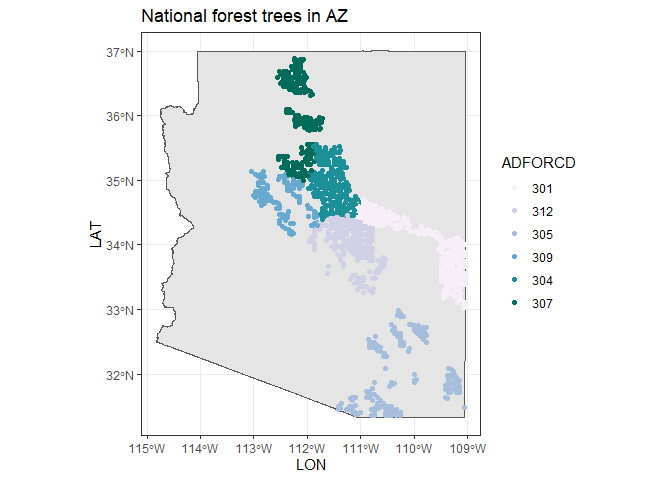

# Extract trees from national forests


``` r
library(ggplot2)
library(tigris)
```

    Warning: package 'tigris' was built under R version 4.4.1

    To enable caching of data, set `options(tigris_use_cache = TRUE)`
    in your R script or .Rprofile.

``` r
source(here::here("R", "query_tables_db_fxns.R"))
```

    Loading required package: DBI


    Attaching package: 'dplyr'

    The following objects are masked from 'package:stats':

        filter, lag

    The following objects are masked from 'package:base':

        intersect, setdiff, setequal, union

``` r
source(here::here("R", "query_annualized.R"))
```

# Pulling records

``` r
con <- connect_to_tables(here::here("data", "db", "foresttime-from-state-parquet.duckdb"))
```

``` r
az_nfs <- query_annualized(
  con,
  conditions = create_conditions(
    STATECD == 4,
    OWNCD == 11,
    MULTI_OWNCD_FLAG == FALSE,
    MULTI_ADFORCD_FLAG == FALSE
  ),
  variables = c(
    "LAT",
    "LON",
    "DIA_est",
    "HT_est",
    "ACTUALHT_est",
    "YEAR",
    "OWNCD",
    "ADFORCD",
    "SPCD_CORR",
    "SPCD_FLAG"
  )
)
```

    Joining with `by = join_by(TREE_COMPOSITE_ID, DEATH, DISTURBANCE, DAMAGE)`
    Joining with `by = join_by(TREE_COMPOSITE_ID, SPCD_CORR, TREE_CN, STATUSCD)`
    Joining with `by = join_by(PLOT_COMPOSITE_ID, PLOT, STATECD, COUNTYCD, PLT_CN, INVYR, CYCLE)`
    Joining with `by = join_by(PLOT_COMPOSITE_ID, PLOT, STATECD, COUNTYCD, PLT_CN, CONDID, INVYR, CYCLE, UNITCD, SUBCYCLE)`

# Map of trees in AZ

Here is a map of where the NFS trees are - although they may be swapped
and fuzzed:

``` r
az_nfs_trees <- az_nfs |>
  group_by(TREE_COMPOSITE_ID, LAT, LON, OWNCD, ADFORCD) |>
  summarize(NYEARS = as.factor(length(unique(INVYR)))) |>
  mutate(ADFORCD = as.factor(ADFORCD))

az_state <- tigris::states() |>
  filter(STATEFP == "04")
```

``` r
ggplot(az_state) +
  geom_sf() +
  geom_jitter(data = az_nfs_trees, aes(LON, LAT, color = ADFORCD)) +
  ggtitle("National forest trees in AZ") +
  scale_color_brewer(palette = "PuBuGn") +
  theme_bw()
```



# Annualized DIA and HT measurements

For ADFORCD == 305, because that’s near Tucson.

``` r
adfor_305 <- az_nfs |>
  filter(ADFORCD == "305") |>
  arrange(TREE_COMPOSITE_ID, INVYR)

knitr::kable(head(adfor_305, 20))
```

| TREE_COMPOSITE_ID | PLOT_COMPOSITE_ID | YEAR | SPCD |  PLOT | SUBP | COUNTYCD | STATECD |       PLT_CN | INVYR | CYCLE | MEASYEAR |      TREE_CN |      COND_CN | CONDID |      LAT |       LON | DIA_est | HT_est | ACTUALHT_est | OWNCD | ADFORCD | SPCD_CORR | SPCD_FLAG |
|:------------------|:------------------|-----:|-----:|------:|-----:|---------:|--------:|-------------:|------:|------:|---------:|-------------:|-------------:|-------:|---------:|----------:|--------:|-------:|-------------:|------:|--------:|----------:|:----------|
| 4_1_19_80908_1_1  | 4_1_19_80908      | 2007 |  122 | 80908 |    1 |       19 |       4 | 1.216394e+13 |  2007 |     3 |     2007 | 1.216395e+13 | 1.216394e+13 |      1 | 32.43407 | -110.8141 |    20.1 |     83 |         58.0 |    11 |     305 |       202 | TRUE      |
| 4_1_19_80908_1_1  | 4_1_19_80908      | 2008 |  122 | 80908 |    1 |       19 |       4 | 1.216394e+13 |  2007 |     3 |     2007 | 1.216395e+13 | 1.216394e+13 |      1 | 32.43407 | -110.8141 |    20.1 |     83 |         58.0 |    11 |     305 |       202 | TRUE      |
| 4_1_19_80908_1_1  | 4_1_19_80908      | 2009 |  122 | 80908 |    1 |       19 |       4 | 1.216394e+13 |  2007 |     3 |     2007 | 1.216395e+13 | 1.216394e+13 |      1 | 32.43407 | -110.8141 |    20.1 |     83 |         58.0 |    11 |     305 |       202 | TRUE      |
| 4_1_19_80908_1_1  | 4_1_19_80908      | 2010 |  122 | 80908 |    1 |       19 |       4 | 1.216394e+13 |  2007 |     3 |     2007 | 1.216395e+13 | 1.216394e+13 |      1 | 32.43407 | -110.8141 |    20.1 |     83 |         58.0 |    11 |     305 |       202 | TRUE      |
| 4_1_19_80908_1_1  | 4_1_19_80908      | 2011 |  122 | 80908 |    1 |       19 |       4 | 1.216394e+13 |  2007 |     3 |     2007 | 1.216395e+13 | 1.216394e+13 |      1 | 32.43407 | -110.8141 |    20.1 |     83 |         58.0 |    11 |     305 |       202 | TRUE      |
| 4_1_19_80908_1_1  | 4_1_19_80908      | 2012 |  122 | 80908 |    1 |       19 |       4 | 1.216394e+13 |  2007 |     3 |     2007 | 1.216395e+13 | 1.216394e+13 |      1 | 32.43407 | -110.8141 |    20.1 |     83 |         58.0 |    11 |     305 |       202 | TRUE      |
| 4_1_19_80908_1_1  | 4_1_19_80908      | 2013 |  122 | 80908 |    1 |       19 |       4 | 1.216394e+13 |  2007 |     3 |     2007 | 1.216395e+13 | 1.216394e+13 |      1 | 32.43407 | -110.8141 |    20.1 |     83 |         58.0 |    11 |     305 |       202 | TRUE      |
| 4_1_19_80908_1_1  | 4_1_19_80908      | 2014 |  122 | 80908 |    1 |       19 |       4 | 1.216394e+13 |  2007 |     3 |     2007 | 1.216395e+13 | 1.216394e+13 |      1 | 32.43407 | -110.8141 |    20.1 |     83 |         58.0 |    11 |     305 |       202 | TRUE      |
| 4_1_19_80908_1_1  | 4_1_19_80908      | 2015 |  122 | 80908 |    1 |       19 |       4 | 1.216394e+13 |  2007 |     3 |     2007 | 1.216395e+13 | 1.216394e+13 |      1 | 32.43407 | -110.8141 |    20.1 |     83 |         58.0 |    11 |     305 |       202 | TRUE      |
| 4_1_19_80908_1_1  | 4_1_19_80908      | 2016 |  122 | 80908 |    1 |       19 |       4 | 1.216394e+13 |  2007 |     3 |     2007 | 1.216395e+13 | 1.216394e+13 |      1 | 32.43407 | -110.8141 |    20.1 |     83 |         58.0 |    11 |     305 |       202 | TRUE      |
| 4_1_19_80908_1_1  | 4_1_19_80908      | 2017 |  202 | 80908 |    1 |       19 |       4 | 1.887798e+14 |  2017 |     4 |     2017 | 5.502282e+14 | 5.502282e+14 |      1 | 32.43407 | -110.8141 |    20.1 |     83 |         58.0 |    11 |     305 |       202 | FALSE     |
| 4_1_19_80908_1_3  | 4_1_19_80908      | 2007 |  122 | 80908 |    1 |       19 |       4 | 1.216394e+13 |  2007 |     3 |     2007 | 1.216395e+13 | 1.216394e+13 |      1 | 32.43407 | -110.8141 |    11.5 |     51 |         48.0 |    11 |     305 |       122 | FALSE     |
| 4_1_19_80908_1_3  | 4_1_19_80908      | 2008 |  122 | 80908 |    1 |       19 |       4 | 1.216394e+13 |  2007 |     3 |     2007 | 1.216395e+13 | 1.216394e+13 |      1 | 32.43407 | -110.8141 |    11.5 |     51 |         43.9 |    11 |     305 |       122 | FALSE     |
| 4_1_19_80908_1_3  | 4_1_19_80908      | 2009 |  122 | 80908 |    1 |       19 |       4 | 1.216394e+13 |  2007 |     3 |     2007 | 1.216395e+13 | 1.216394e+13 |      1 | 32.43407 | -110.8141 |    11.5 |     51 |         39.8 |    11 |     305 |       122 | FALSE     |
| 4_1_19_80908_1_3  | 4_1_19_80908      | 2010 |  122 | 80908 |    1 |       19 |       4 | 1.216394e+13 |  2007 |     3 |     2007 | 1.216395e+13 | 1.216394e+13 |      1 | 32.43407 | -110.8141 |    11.5 |     51 |         35.7 |    11 |     305 |       122 | FALSE     |
| 4_1_19_80908_1_3  | 4_1_19_80908      | 2011 |  122 | 80908 |    1 |       19 |       4 | 1.216394e+13 |  2007 |     3 |     2007 | 1.216395e+13 | 1.216394e+13 |      1 | 32.43407 | -110.8141 |    11.5 |     51 |         31.6 |    11 |     305 |       122 | FALSE     |
| 4_1_19_80908_1_3  | 4_1_19_80908      | 2012 |  122 | 80908 |    1 |       19 |       4 | 1.216394e+13 |  2007 |     3 |     2007 | 1.216395e+13 | 1.216394e+13 |      1 | 32.43407 | -110.8141 |    11.5 |     51 |         27.5 |    11 |     305 |       122 | FALSE     |
| 4_1_19_80908_1_3  | 4_1_19_80908      | 2013 |  122 | 80908 |    1 |       19 |       4 | 1.216394e+13 |  2007 |     3 |     2007 | 1.216395e+13 | 1.216394e+13 |      1 | 32.43407 | -110.8141 |    11.5 |     51 |         23.4 |    11 |     305 |       122 | FALSE     |
| 4_1_19_80908_1_3  | 4_1_19_80908      | 2014 |  122 | 80908 |    1 |       19 |       4 | 1.216394e+13 |  2007 |     3 |     2007 | 1.216395e+13 | 1.216394e+13 |      1 | 32.43407 | -110.8141 |    11.5 |     51 |         19.3 |    11 |     305 |       122 | FALSE     |
| 4_1_19_80908_1_3  | 4_1_19_80908      | 2015 |  122 | 80908 |    1 |       19 |       4 | 1.216394e+13 |  2007 |     3 |     2007 | 1.216395e+13 | 1.216394e+13 |      1 | 32.43407 | -110.8141 |    11.5 |     51 |         15.2 |    11 |     305 |       122 | FALSE     |

# Save data

``` r
write.csv(az_nfs_trees, here::here("use_cases", "nfs", "arizona_natl_forest_trees.csv"))
```

The saved file is 1 MB.

## Clean up

``` r
dbDisconnect(con, shutdown = TRUE)
```
