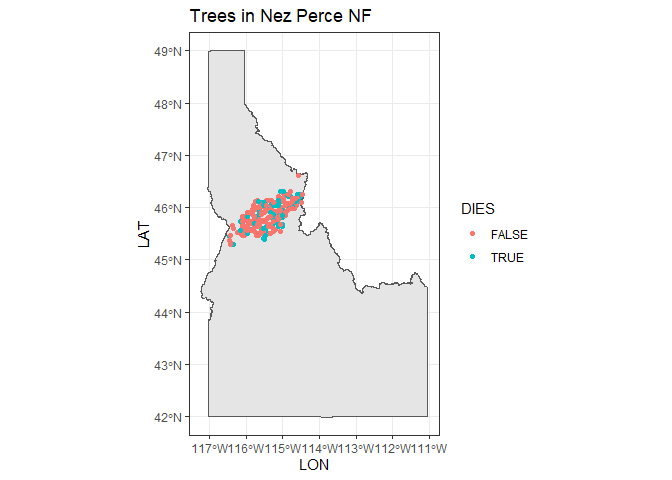
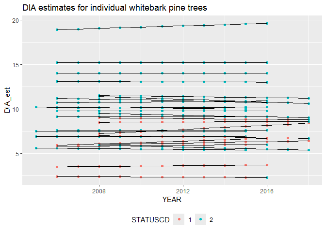
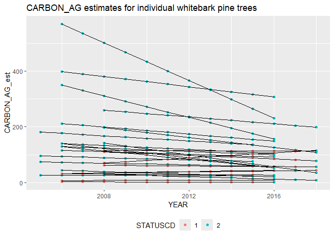
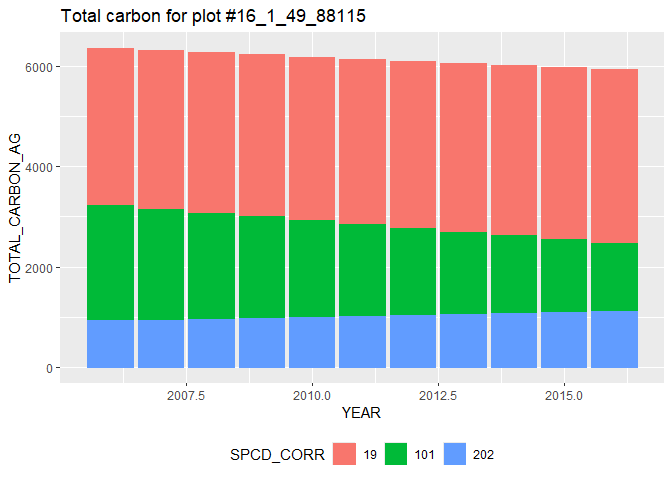
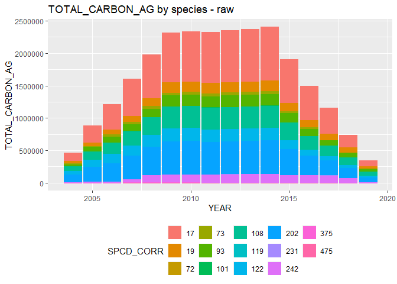
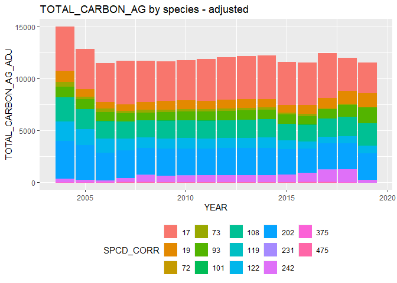
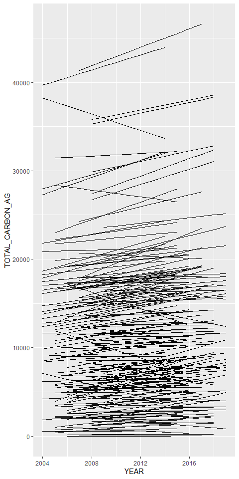

# Extract trees from national forests


``` r
library(ggplot2)
library(tigris)
```

    Warning: package 'tigris' was built under R version 4.4.1

    To enable caching of data, set `options(tigris_use_cache = TRUE)`
    in your R script or .Rprofile.

``` r
source(here::here("R", "query_tables_db_fxns.R"))
```

    Loading required package: DBI


    Attaching package: 'dplyr'

    The following objects are masked from 'package:stats':

        filter, lag

    The following objects are masked from 'package:base':

        intersect, setdiff, setequal, union

``` r
source(here::here("R", "query_annualized.R"))
```

# Pulling records

``` r
con <- connect_to_tables(here::here("data", "db", "foresttime-from-state-parquet-carbon.duckdb"))
```

``` r
nezperce_nfs <- query_annualized(
  con,
  conditions = create_conditions(
    ADFORCD == 117,
    MULTI_OWNCD_FLAG == FALSE,
    MULTI_ADFORCD_FLAG == FALSE
  ),
  variables = c(
    "LAT",
    "LON",
    "DIA_est",
    "HT_est",
    "ACTUALHT_est",
    "CARBON_AG_est",
    "CARBON_BG_est",
    "STATUSCD",
    "YEAR",
    "OWNCD",
    "ADFORCD",
    "SPCD_CORR",
    "SPCD_FLAG"
  )
)
```

    Joining with `by = join_by(TREE_COMPOSITE_ID, DEATH, DISTURBANCE, DAMAGE)`
    Joining with `by = join_by(TREE_COMPOSITE_ID, SPCD_CORR, TREE_CN, STATUSCD)`
    Joining with `by = join_by(PLOT_COMPOSITE_ID, PLOT, STATECD, COUNTYCD, PLT_CN, INVYR, CYCLE)`
    Joining with `by = join_by(PLOT_COMPOSITE_ID, PLOT, STATECD, COUNTYCD, PLT_CN, CONDID, INVYR, CYCLE, UNITCD, SUBCYCLE)`

# Map of trees in Nez Perce

Here is a map of where the NFS trees are - although they may be swapped
and fuzzed:

``` r
np_nfs_trees <- nezperce_nfs |>
  group_by(TREE_COMPOSITE_ID, LAT, LON, OWNCD, ADFORCD, SPCD_CORR) |>
  summarize(NYEARS = as.factor(length(unique(INVYR))),
            DIES = any(STATUSCD == 2)) |>
  mutate(ADFORCD = as.factor(ADFORCD),
         SPCD_CORR = as.factor(SPCD_CORR))

np_state <- tigris::states() |>
  filter(STATEFP == "16")
```

``` r
ggplot(np_state) +
  geom_sf() +
  geom_jitter(data = np_nfs_trees, aes(LON, LAT, color = DIES)) +
  ggtitle("Trees in Nez Perce NF") +
  theme_bw()
```



# Annualized measurements - whitebark pine

``` r
ggplot(nezperce_nfs |> filter(SPCD_CORR == 101) |> mutate(STATUSCD = as.factor(STATUSCD)), aes(YEAR, DIA_est, group = TREE_COMPOSITE_ID)) +
  geom_point(aes(color = STATUSCD)) +
  geom_line() +
  theme(legend.position = "bottom") +
  ggtitle("DIA estimates for individual whitebark pine trees")
```



``` r
ggplot(nezperce_nfs |> filter(SPCD_CORR == 101) |>
         mutate(STATUSCD = as.factor(STATUSCD)), aes(YEAR, CARBON_AG_est, group = TREE_COMPOSITE_ID)) +
  geom_point(aes(color = STATUSCD)) +
  geom_line() +
  theme(legend.position = "bottom") +
  ggtitle("CARBON_AG estimates for individual whitebark pine trees")
```



# Total carbon estimates

``` r
nezperce_plot_species_carbon <- nezperce_nfs |>
  group_by(YEAR, PLOT_COMPOSITE_ID, SPCD_CORR) |>
  summarize(TOTAL_CARBON_AG = sum(CARBON_AG_est)) |>
  ungroup() |>
  mutate(SPCD_CORR = as.factor(SPCD_CORR))
```

    `summarise()` has grouped output by 'YEAR', 'PLOT_COMPOSITE_ID'. You can
    override using the `.groups` argument.

``` r
ggplot(nezperce_plot_species_carbon |> filter(PLOT_COMPOSITE_ID == "16_1_49_88115"), aes(YEAR, TOTAL_CARBON_AG, color = SPCD_CORR, fill = SPCD_CORR)) +
  geom_col(position = "stack") + 
  theme(legend.position = "bottom")   +
  ggtitle("Total carbon for plot #16_1_49_88115")
```



``` r
nezperce_carbon <- nezperce_nfs |>
  group_by(YEAR) |> 
  mutate(PLOTS_IN_SAMPLE = length(unique(PLOT_COMPOSITE_ID))) |>
  ungroup() |>
  group_by(YEAR, SPCD_CORR, PLOTS_IN_SAMPLE) |>
  summarize(TOTAL_CARBON_AG = sum(CARBON_AG_est)) |>
  ungroup() |>
  mutate(SPCD_CORR = as.factor(SPCD_CORR),
         TOTAL_CARBON_AG_ADJ = TOTAL_CARBON_AG / PLOTS_IN_SAMPLE)
```

    `summarise()` has grouped output by 'YEAR', 'SPCD_CORR'. You can override using
    the `.groups` argument.

``` r
ggplot(nezperce_carbon, aes(YEAR, TOTAL_CARBON_AG, color = SPCD_CORR, fill = SPCD_CORR)) +
  geom_col(position = "stack") +
  theme(legend.position = "bottom") +
  ggtitle("TOTAL_CARBON_AG by species - raw")
```



``` r
ggplot(nezperce_carbon, aes(YEAR, TOTAL_CARBON_AG_ADJ, color = SPCD_CORR, fill = SPCD_CORR)) +
  geom_col(position = "stack") +
  theme(legend.position = "bottom") +
  ggtitle("TOTAL_CARBON_AG by species - adjusted")
```



``` r
nezperce_plot_carbon <- nezperce_nfs |>
  group_by(YEAR, PLOT_COMPOSITE_ID) |>
  summarize(TOTAL_CARBON_AG = sum(CARBON_AG_est)) |>
  ungroup() 
```

    `summarise()` has grouped output by 'YEAR'. You can override using the
    `.groups` argument.

``` r
ggplot(nezperce_plot_carbon, aes(YEAR, TOTAL_CARBON_AG, group = PLOT_COMPOSITE_ID)) +
  geom_line()
```



## Clean up

``` r
dbDisconnect(con, shutdown = TRUE)
```
