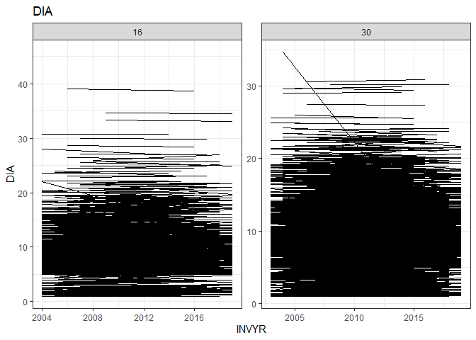

# Extracting FIA timeseries

# Whitebark pine for Montana, Idaho, and Wyoming

SPCD = 101

STATECD = 16, 30, 56

``` r
whitebark_pine <- get_timeseries(conditions = list(
  STATECD = list("%in%", c(16, 30, 56)),
  SPCD = list("==", 101)
))
```

    Joining with `by = join_by(PLT_CN, INVYR, UNITCD, PLOT, PLOT_UNIQUE_ID, COUNTYCD, STATECD)`
    Joining with `by = join_by(PLT_CN, INVYR, UNITCD, PLOT, PLOT_UNIQUE_ID, COUNTYCD, STATECD)`

``` r
knitr::kable(head(whitebark_pine))
```

| TREE_UNIQUE_ID     | PLOT_UNIQUE_ID |      TREE_CN | PREV_TRE_CN |       PLT_CN | INVYR | UNITCD | SUBP | TREE |  PLOT | STATUSCD |  DIA |  HT | ACTUALHT | SPCD | CYCLE | COUNTYCD | STATECD | PREV_PLT_CN | PLOT_STATUS_CD | PLOT_NONSAMPLE_REASN_CD | MEASYEAR | MEASMON | MEASDAY | REMPER | KINDCD | DESIGNCD | RDDISTCD | WATERCD |      LAT |       LON | ELEV |           CN | CONDID | COND_STATUS_CD | COND_NONSAMPLE_REASN_CD |
|:-------------------|:---------------|-------------:|------------:|-------------:|------:|-------:|-----:|-----:|------:|---------:|-----:|----:|---------:|-----:|------:|---------:|--------:|------------:|---------------:|:------------------------|---------:|--------:|--------:|-------:|-------:|---------:|---------:|--------:|---------:|----------:|-----:|-------------:|-------:|---------------:|:------------------------|
| 16_1_17_81594_1_4  | 16_1_17_81594  | 4.249793e+13 |          NA | 3.727554e+13 |  2010 |      1 |    1 |    4 | 81594 |        1 | 16.7 |  47 |       47 |  101 |     2 |       17 |      16 |          NA |              1 | NA                      |     2010 |      10 |       6 |     NA |      1 |        1 |        7 |       0 | 48.39234 | -116.1243 | 6190 | 4.249793e+13 |      1 |              1 | NA                      |
| 16_1_17_81594_1_7  | 16_1_17_81594  | 4.249794e+13 |          NA | 3.727554e+13 |  2010 |      1 |    1 |    7 | 81594 |        2 | 13.8 |  36 |       33 |  101 |     2 |       17 |      16 |          NA |              1 | NA                      |     2010 |      10 |       6 |     NA |      1 |        1 |        7 |       0 | 48.39234 | -116.1243 | 6190 | 4.249793e+13 |      1 |              1 | NA                      |
| 16_1_17_81594_3_11 | 16_1_17_81594  | 4.249797e+13 |          NA | 3.727554e+13 |  2010 |      1 |    3 |   11 | 81594 |        2 |  9.0 |  28 |       17 |  101 |     2 |       17 |      16 |          NA |              1 | NA                      |     2010 |      10 |       6 |     NA |      1 |        1 |        7 |       0 | 48.39234 | -116.1243 | 6190 | 4.249793e+13 |      1 |              1 | NA                      |
| 16_1_17_81594_3_15 | 16_1_17_81594  | 4.249798e+13 |          NA | 3.727554e+13 |  2010 |      1 |    3 |   15 | 81594 |        2 | 10.5 |  32 |       32 |  101 |     2 |       17 |      16 |          NA |              1 | NA                      |     2010 |      10 |       6 |     NA |      1 |        1 |        7 |       0 | 48.39234 | -116.1243 | 6190 | 4.249793e+13 |      1 |              1 | NA                      |
| 16_1_17_81594_3_18 | 16_1_17_81594  | 4.249798e+13 |          NA | 3.727554e+13 |  2010 |      1 |    3 |   18 | 81594 |        2 |  7.7 |  32 |       32 |  101 |     2 |       17 |      16 |          NA |              1 | NA                      |     2010 |      10 |       6 |     NA |      1 |        1 |        7 |       0 | 48.39234 | -116.1243 | 6190 | 4.249793e+13 |      1 |              1 | NA                      |
| 16_1_17_81594_3_19 | 16_1_17_81594  | 4.249798e+13 |          NA | 3.727554e+13 |  2010 |      1 |    3 |   19 | 81594 |        2 |  6.9 |  22 |       14 |  101 |     2 |       17 |      16 |          NA |              1 | NA                      |     2010 |      10 |       6 |     NA |      1 |        1 |        7 |       0 | 48.39234 | -116.1243 | 6190 | 4.249793e+13 |      1 |              1 | NA                      |

## How many trees have been surveyed how many times in each state?

| STATECD | n_measures | n_trees |
|--------:|-----------:|--------:|
|      16 |          1 |    1190 |
|      16 |          2 |    2065 |
|      16 |          3 |       1 |
|      30 |          1 |    2607 |
|      30 |          2 |    5882 |
|      30 |          3 |     199 |
|      56 |          1 |    8094 |

**Notably, zero trees in Wyoming (STATECD = 56) have been surveyed more
than one time.**

## Plotting DIA, HT of trees with repeated measurements




## Saving data to share

``` r
write.csv(whitebark_pine, here::here("data", "whitebark_pine.csv"))
```

The saved file is 6 MB.
